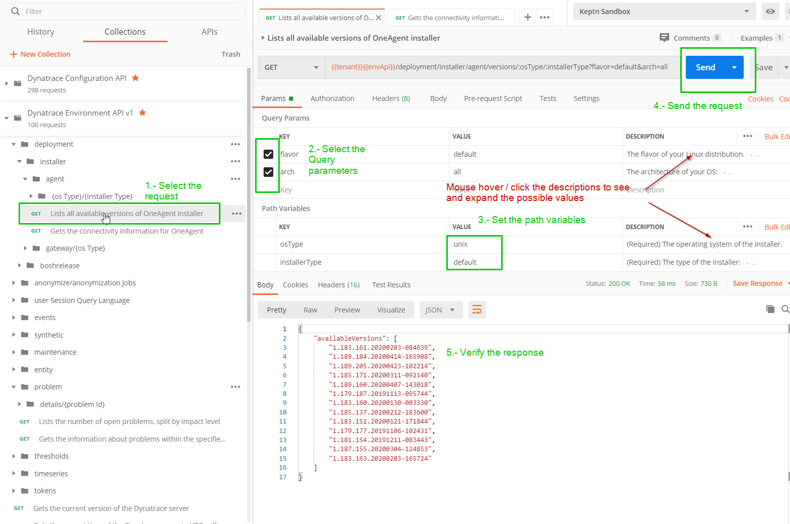

> ***🥼⚗ Spend more time innovating and less time configuring***

# Importing & generating a 📬 Postman Collection from & for the Dynatrace API 

This repository is a quick explanation how to generate a Postman collection **(sorted out, with examples, query parameters, path variables, descriptions and documentation 📖)** from the OpenApi spec so you can keep your collections updated with the Dynatrace API development. This repo also contains the parameterized Collections and some tips so you get started quickly with the [Dynatrace API](https://www.dynatrace.com/support/help/extend-dynatrace/dynatrace-api/).

## Actual Version of the generated collections
Build 192.87

## Get Started with Postman and the Dynatrace API's

### Import the Collections in Postman

For getting you started. Let's import the 3 collections for the Environment API (environment v1, environment v2 and configuration)

1. Open Postman

2. On the Top-left click **Import**

3. Drag and Drop the *[Dynatrace..].postman_collection.json* file in the opened window. (Located under the **collections** 📁folder)

You are done! Repeat for the number of collections you want to import.

If you notice the collections are documented, they include examples in the Body of the Post Methods, are documented and also include parameters when needed.

### Set your `tenant` and `apiToken` variables

The Collections are parameterized so you can quickly change from personal or customer's environment SaaS or Managed, sprint or production, does not matter. If you have already environments, just make sure that the variables are setted with **protocol** and **no leading slashes**, like the following:

>Dynatrace Tenant **https://your-domain/e/{your-environment-id}** for managed or **https://your-environment-id.live.dynatrace.com** for SaaS

| variable | value    |
|-------|-----------------|
| tenant  |https://myenvId.live.dynatrace.com  |
| apiToken  | myApiToken    |


1. Go to Manage environments (Top-Right) Open Postman

2. Click either on **Add** or if you have one Environment on it

3. Add the two variables (mentioned above) or make sure the key and the format are correct.

You are done!

Now REST and enjoy! 

### Quick intro on how to use the generated params and path variables

Let's say I want to list all available OneAgent Installer Linux versions available on the Cluster. I go to Environment v1 > Deployment > Installer > agent




1. Click o the request
2. Select the query parameters (query parameters are always optional)
3. Set the path variables (if you notice in the request url you will find this variables)
4. Send the request
5. Analyze the response

### Where is the Authorization? 
The Authorization Header is setted at the Collection level. All the requests are imported so that they per default inherit the authorization from the parent. 

## Generate your own Postman Collections
Generate the Postman Collections is fairly simple. Altough there are unfortunately some manual steps for importing and setting the Collection as wished. Below are the steps needed for generating them so other users can import them without any further configurations.

1. ### Login to the tenant and download the specification. 


2. ### Parameterize the Server variable

From
```json
  "servers" : [ {
    "url" : "https://abc123.live.dynatrace.com/api/config/v1",
    "variables" : { }
  } ],
```

To
```json
  "servers" : [ {
    "url" : "{{tenant}}{{configApi}}",
    "variables" : { }
  } ],
```
for the environment specs do {{envApi}}.


3. ### Remove securitySchemes

Here we need to remove (rename) the securitySchemes. By just changing the name of the Element is enough, this way all the requests wont get generated with the header **Authorization** with no values and the Authorization tab will be setted to **inherited**. Otherwise the authorization will be setted to no auth and you have to change this every new request you want to use. This way the authorization can be inherited from the collection Authorization settings.

This element is found at the bottom, You can also do a *sed* to quick replace it.
From
```json
  "securitySchemes" 
```

To
```json
  "__securitySchemes" 
```

4. ### Import the  json spec

you can drag and drop it.

5. ### Set the Authorization and api endpoint Variable

After is imported go to settings:

and enter this values in the Authorization of the Collection:

|       |                |
|-------|-----------------|
| type  | API Key         |
| key   |  Authorization  |
| value | Api-Token {{apiToken}} |
|Add to | Add to header |


Then go to Variables and define the configApi variable


| variable  | initial value    | current value   |
|------------|-----------------|-----------------|
| configApi  | /api/config/v1  |  /api/config/v1 |


for envApi would be the same with its respective endpoint.
You are done. The collection is the same as the ones in the **collections** 📁 folder


## 🤲Contributing
If you want to contribute, do the steps described in  **Generate your own Postman Collections**. Export the collections and update the files under the collections and specs folder. Make a pull request. Done!
